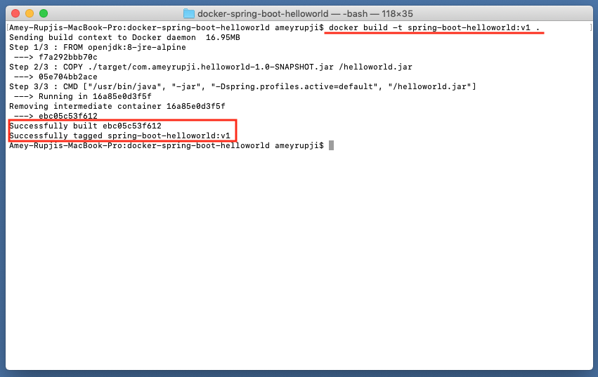
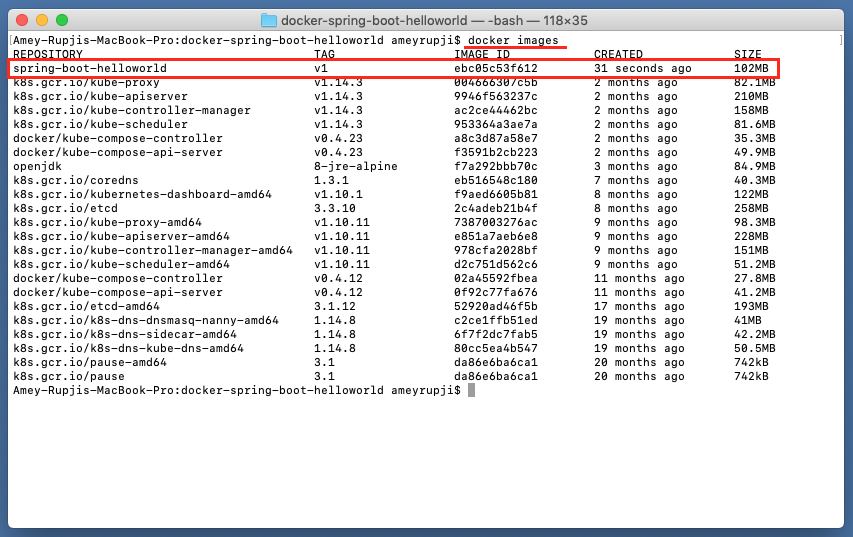
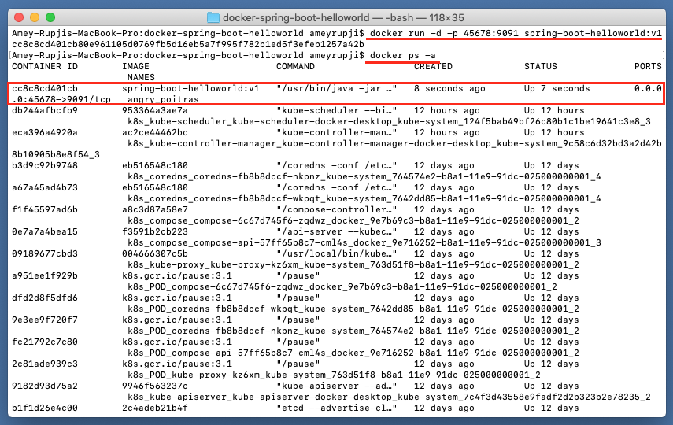
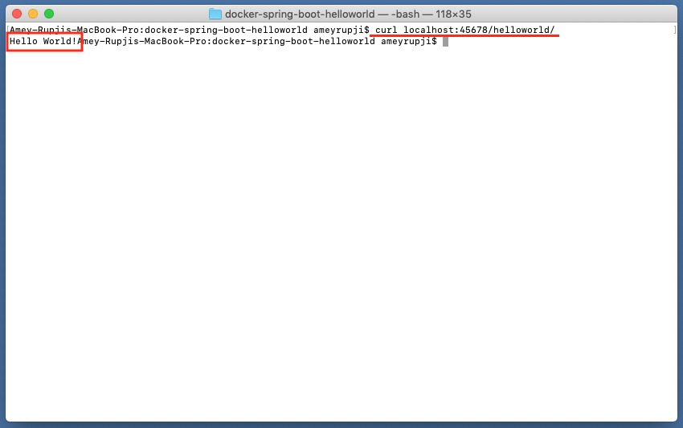
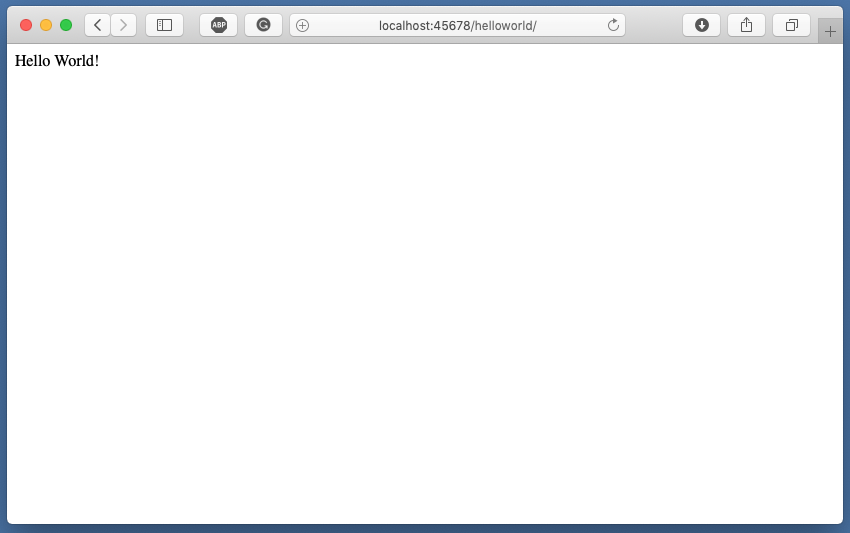

| ◂ [Previous](https://github.com/ameyrupji-k8s/spring-boot-helloworld) |
|-----|

# docker-spring-boot-helloworld

Taking the Basic Hello World Application in Spring Boot! further. This example creates a docker container containing a Spring Boot application with a Controller that returns "Hello World!".

**Note:** Refer [spring-boot-helloworld](https://github.com/ameyrupji-k8s/spring-boot-helloworld) repo.


## Prerequisites

- Java IDE (I am using IntelliJ CE)
- Maven
- Docker


## System Configuration at time of test

- macOS Mojave - Version 10.14.6
- IntelliJ CE - Version CE 2019.2
- Maven - Version 3.6.1
- Docker Desktop - Version 2.1.0.1 (37199)

## Initial Setup

### Creating Spring project

Follow the steps outlined in [spring-boot-helloworld](https://github.com/ameyrupji/spring-boot-helloworld) GitHub project to create a Spring Boot application.

### Dockerizing the application

Add `Dockerfile`

```sh
FROM openjdk:8-jre-alpine
COPY ./target/com.ameyrupji.helloworld-1.0-SNAPSHOT.jar /helloworld.jar

CMD ["/usr/bin/java", "-jar", "-Dspring.profiles.active=default", "/helloworld.jar"]

```

### Build docker image

To build the docker image run the following command on the terminal: `docker build -t spring-boot-helloworld:v1 .`




To list the created docker images run the command on the terminal: `docker images`



### Run the Docker Container

Run the following command to spin up the container server: `docker run -d -p 45678:9091 spring-boot-helloworld:v1`

To list all the containers running run this command on the terminal: `docker ps -a`




## Test 


Run the following command to ensure the server is running: `curl localhost:45678/helloworld/`



You can also view it in the browser by going to `http://localhost:45678/helloworld/` and following response will show up:




## Cleanup

To stop the container that is running use this command: `docker stop {container_id}`

To delete the container that was created use this command: `docker rm {container_id}`

To delete the docker image that was created: `docker rmi {image_id}`

## Useful links

- https://github.com/ameyrupji-k8s/spring-boot-helloworld
- https://github.com/ameyrupji/docker-nginx-static-html-demo
- https://stackify.com/guide-docker-java/

| [Next ▸](https://github.com/ameyrupji-k8s/k8s-docker-spring-boot-helloworld) |
|-----|
